# El algoritmo de Dijkstra

El algoritmo de Dijkstra te permite calcular la ruta más corta entre un nodo (tú eliges cuál) y **todos los demás nodos en el grafo**. Encontrarás una descripción del algoritmo al final de esta página, pero ¡vamos a estudiarlo con un ejemplo explicado! Calcularemos la distancia más corta entre el nodo C y los demás nodos del grafo:

Durante la ejecución del algoritmo, iremos marcando cada nodo con su _distancia mínima_ al nodo C (nuestro nodo elegido). Para el nodo C, esta distancia es 0. Para el resto de nodos, como todavía no conocemos esa distancia mínima, empieza siendo infinita (∞):

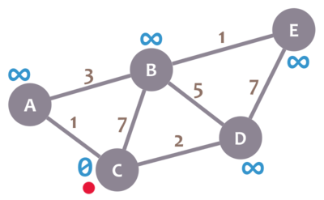

También tendremos un _nodo actual_. Inicialmente, el nodo actual será C (nuestro nodo elegido). En la imagen, marcaremos el nodo actual con un punto rojo.

Ahora, revisaremos los vecinos de nuestro nodo actual (A, B y D) en cualquier orden. Empecemos con B. Sumamos la mínima distancia del nodo actual (en este caso, 0) con el peso de la arista que conecta al nodo actual con B (en este caso, 7), y obtenemos 0 + 7 = 7. Comparamos ese valor con la mínima distancia de B (infinito); el valor más pequeño es el que queda como la distancia mínima de B (en este caso, 7 es menos que infinito):

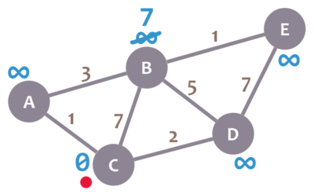

Bien. Ahora revisaremos al vecino A. Sumamos 0 (la distancia mínima de C, nuestro nodo actual) con 1 (el peso de la arista que conecta nuestro nodo actual con A) para obtener 1. Comparamos ese 1 con la mínima distancia de A (infinito) y dejamos el menor valor:

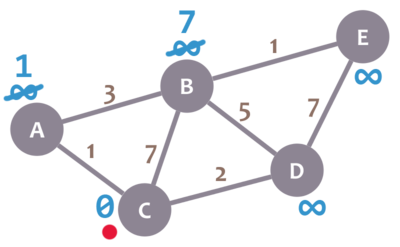

OK. Repetimos el procedimiento para D:

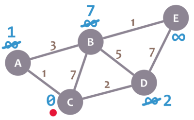

Genial. Hemos revisado todos los vecinos de C. Por ello, lo marcamos como _visitado_. Representemos a los nodos visitados con una marca de verificación verde:

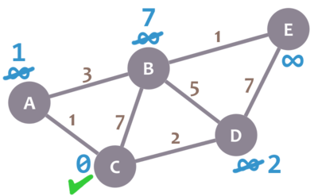

Ahora debemos seleccionar un nuevo _nodo actual_. Ese nodo debe ser el nodo no visitado con la menor distancia mínima, es decir, el nodo con el menor número y sin marca de verificación verde. En este caso, ese nodo es A. Vamos a marcarlo con el punto rojo:

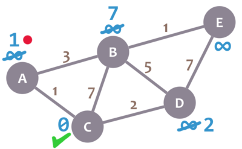

Ahora, repetimos el algoritmo. Revisamos los vecinos de nuestro nodo actual, ignorando los visitados. Esto significa que solo revisaremos B.

Para B, sumamos 1 (la distancia mínima de A, nuestro nodo actual) con 3 (el peso de la arista conectando a A con B) para obtener 4. Comparamos ese 4 con la distancia mínima de B (7) y dejamos el menor valor: 4.

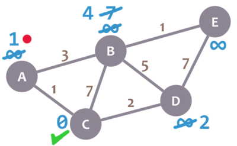

Después, marcamos A como visitado y elegimos un nuevo nodo: D, que es el nodo no visitado con la menor distancia mínima.

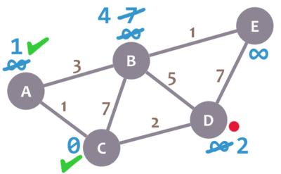

Repetimos el algoritmo de nuevo. Esta vez, revisamos B y E.

Para B, obtenemos 2 + 5 = 7. Comparamos ese valor con la distancia mínima de B (4) y dejamos el menor valor (4). Para E, obtenemos 2 + 7 = 9, lo comparamos con la distancia mínima de E (infinito) y dejamos el valor menor (9).

Marcamos D como visitado y establecemos nuestro nodo actual en B.

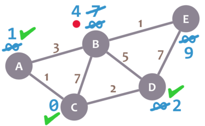

Casi terminamos. Sólo debemos verificar E. 4 + 1 = 5, que es menos que la distancia mínima de E (9), así que dejamos el 5. Marcamos B como visitado y establecemos E como el nodo actual.

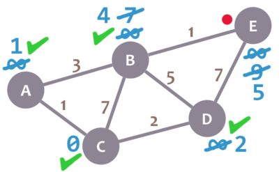

E no tiene vecinos no visitados, así que no verificamos nada. Lo marcamos como visitado.

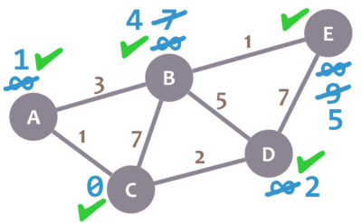

Como no hay nodos no visitados, ¡terminamos! La distancia mínima de cada nodo ahora representa la mínima distancia entre ese nodo y el nodo C (el nodo que elegimos como nodo inicial).

Aquí está una descripción del algoritmo:
1. Marca el nodo inicial que elegiste con una distancia actual de 0 y el resto con infinito.
2. Establece el nodo no visitado con la menor distancia actual como el nodo actual `A`.
3. Para cada vecino `V` de tu nodo actual `A`: suma la distancia actual de `A` con el peso de la arista que conecta a `A` con `V`. Si el resultado es menor que la distancia actual de `V`, establécelo como la nueva distancia actual de `V`.
4. Marca el nodo actual `A` como visitado.
5. Si hay nodos no visitados, ve al paso 2.

# Ejercicio
La función de Python que se muestra debajo se usa durante el paso 2 del algoritmo para seleccionar el nodo que debe establecerse como nodo actual. Corrígela para que elija el nodo correcto.

@[La función mostrada debe seleccionar un nuevo nodo actual para el algoritmo de Dijkstra. Corrígela para que lo haga correctamente.]({"stubs": ["nodes.py"], "command": "python3 test_nodes.py"})

# Siguiente paso
Para obtener las rutas que corresponden a esos valores mínimos, simplemente necesitamos llevar la cuenta de los nodos cada vez que cambiamos la mínima distancia de un nodo. ¡Sigue leyendo para verlo!
