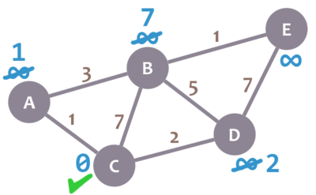

# Encontrando rutas, también

Vamos a ejecutar el algoritmo de nuevo en nuestro grafo:


Esta vez, sin embargo, vamos a llevar un registro de las actuales rutas más cortas. Todas empiezan vacías, excepto la del nodo inicial, que simplemente lo contiene:

```python
ruta hasta A = vacía
ruta hasta B = vacía
ruta hasta C = C
ruta hasta D = vacía
ruta hasta E = vacía
```

Lo nuevo ahora es que actualizaremos esas rutas _cada vez que modifiquemos la distancia mínima de un nodo_.

Vamos a revisar los vecinos de nuestro nodo actual. Empezaremos con B. Añadimos 0 + 7 = 7. Como ese valor es menor que infinito, cambiamos la mínima distancia de B con él _y reemplazamos la ruta actual de B_ con la ruta del nodo actual (`ruta hasta C`, que es `C`) más B. Esto significa que `ruta de B = C, B`.

Repetimos el procedimiento con los vecinos A y D. Después de eso, nuestro grafo y nuestras rutas son:



```python
path to A = C, A
path to B = C, B
path to C = C
path to D = C, D
path to E = empty
```
Nuestro nodo actual ahora es A. Verificamos su único vecino no visitado, B. Cuando reemplazamos la mínima distancia de B de 7 a 4, también reemplazamos su ruta actual con la ruta del nodo actual A (`C, A`) más B: `ruta hasta B = C, A, B`.


```python
path to A = C, A
path to B = C, A, B
path to C = C
path to D = C, D
path to E = empty
```

Marcamos A como visitado y seleccionamos nuestro próximo nodo actual: D. Verificaremos dos vecinos: B y E.

Cuando verificamos B, no reemplazamos su mínima distancia (ya que el 4 existente es menor al 7 calculado), así que tampoco reemplazamos su ruta actual. Recuerda: sólo reemplazamos una ruta cuando modificamos la mínima distancia de un nodo.

Luego verificamos E, actualizamos su mínima distancia (9, que es menos que infinito) y su ruta (`ruta hasta E = C, D, E`, que es la `ruta hasta D` más E), y obtenemos esto:


```python
path to A = C, A
path to B = C, A, B
path to C = C
path to D = C, D
path to E = C, D, E
```

Vamos a adelantarnos un poco: continuamos aplicando el algoritmo hasta que esté listo. Una vez terminemos, nuestro grafo y rutas serán:


```python
path to A = C, A
path to B = C, A, B
path to C = C
path to D = C, D
path to E = C, A, B, E
```

¡Felicitaciones! Esas son las mínimas rutas entre C y cualquier otro nodo.
