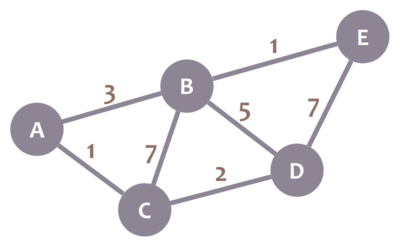

# ¡Te doy la bienvenida!

Este _playground_ corto te dará algunos fundamentos sobre el algoritmo de Dijkstra.

# Prerrequisitos
* Fundamentos de teoría de grafos: grafos, vértices y aristas. Puedes aprenderlo todo en este _playground_: [Fundamentos de teoría de grafos](https://tech.io/playgrounds/7023/fundamentos-de-teoria-de-grafos-espeng).

# Grafos con pesos

En algunas aplicaciones, es útil modelar información con un grafo con aristas con pesos. A esos grafos se les llama "grafos con pesos". 

Te estarás preguntando qué son las "aristas con pesos". Mira este grafo:

Imaginemos que cada nodo es una ciudad, y que cada arista es un camino existente entre dos ciudades. Ello significa que puedes conducir de A a B directamente. Sin embargo, no puedes conducir de A a D directamente, porque no hay camino entre esas ciudades; en vez de eso, tendrías que ir, por ejemplo, de A a B y luego de B a D.

Ahora bien, no todos los caminos son iguales. Algunos son más largos, algunos no están en buen estado (de modo que debes ir más lento), algunos tienen más tráfico... En resumen: necesitas más tiempo para atravesar algunos caminos que otros. Podemos representar ese tiempo con pesos que asignamos a los caminos (aristas del grafo). En el ejemplo, supongamos que cada número representa el número de horas que toma atravesar un camino. Ello significa que ir de A a B toma 3 horas si usas el camino que las conecta directamente.

Como descubrirás, puedes representar muchas cosas distintas (tiempo, distancia, dinero...) con los pesos en las aristas de un grafo.

# Caminos

Supón que te pregunto cuánto tiempo tomaría ir de C a B. Podrías decir que tomaría 7 horas si se toma el camino que las conecta directamente. Sin embargo, también podrías decir que puedes hacer el viaje en sólo 4 horas si vas de C a A y luego de A a B. Hay otras rutas que podrías tomar.

Formalmente, un camino es una _secuencia de aristas que conectan una secuencia de vértices distintos_. Si no hay aristas paralelas en tu grafo (es decir, aristas que conectan el mismo par de nodos, como si tuvieras dos carreteras conectando directamente las mismas dos ciudades), puedes describir un camino de manera simplificada como la lista de nodos que éste conecta. Por ejemplo, los dos caminos que mencionamos en nuestro ejemplo son C, B y C, A, B.

# Shortest paths

As we said before, it takes 7 hours to traverse path C, B, and only 4 hours to traverse path C, A, B. Those times are the _weights_ of those paths. As such, we say that the weight of a path is the sum of the weights of the edges it contains.

As you can see, path C, A, B is shorter than path C, B. In fact, it is the shortest path between C and B (try to find a shorter one!). Of course, in lots of applications, it would be really useful to be able to calculate in advance what the shortest path between two nodes is. What's the shortest route I can take to go home? What's the cheapest way I can fly from Bucaramanga to Hawaii? How can I efficiently route this data packet from node 1 to node 2 in this network? That kind of questions can be solved with shortest path algorithms or variants.

So... How can we obtain the shortest path in a graph? There are several options. Dijkstra's algorithm is one of them! Keep reading to know how!

?[Ejercicio: ¿Cuál es el peso del camino más corto entre C y E?]
-[ ] 8
-[ ] 9
-[x] 5
-[ ] 7
